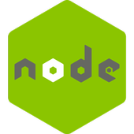

# Node.Js

 

Node.js использует событийно не блокирующую модель **I/O**. Тоесть предоставляется функционал, который позволяет не тормозить процесс пока идёт обработка запроса. Без node.js такое было возможно как минимум через подход через **Thread**, но это было сложно если это первые шаги в данном подходе.

**Node.js** - это совокупность **V8** - движка который способен запускать **javascript** и как минимум языка **C**, который позволяет расширить горизонт работы **javascript**. Имеется в виду, что так как **javascript** не способен работать с файловой системой, с http запросами, с таймерами, но данная возможность должна у него быть так как **Node.js** - это представитель сервера. И что бы добавить всё то, что нет у **javascript**, то на помощь пришла библиотека **LibUV**. 

---

 

**LibUV** - это библиотека языка **C**, которая поддерживает асинхронный ввод-вывод на основе циклов событий. Предоставляет весь не достающий функционал и возможности, которых нет у **javascript**, а это кроссплатформенные операции **I/O**, работа с файлами и сетью.

---

Необходимо понимать, что позволяет **Node.js** выполнять не блокирующие операции. Это называется **Event Loop**.

По простому это цикл событий, который за цикл опрашивает всё необходимое и в зависимости от этого выполянет какие либо действия.

Так же необходимо понимать, что **Node.js** это не однопоточное решение, как говорят многие. По сути сам по себе **Node.js** имеет много потоков, в одном из которых крутится **javascript**.

### Event Loop
---
> Таймеры -> I/O callback -> Ожидание, подготовка -> Опрос (входящие соединения, данные и т.д.) -> Проверка -> Callback close -> [Таймеры]

Важным моментом является понимание как работает **Event loop**, так как из быстрого **Node.js** получится тормозящая нечно.

io fork - это достаточно известный fork, который принёс все возможности которые так ждали разработчики. После того как **fork io** стал успешным его обьединили с **Node.JS 0.12.7** после чего появилась **Node.Js 4.0.0**.

Где стоит применять:

### Node.js стоит применять
---
* Frontend
    * Render HTML
    * API
    * Proxy
* Backend
    * Лёгкая бизнес-логика
* Serverless
    * Node.js лямбда
    * Node.js лямбда
    * Node.js лямбда

По сути Node.js стоит применять где необходимо держать кучу соединений, быстро отвечать на запросы. Всю тяжулую бизнес логику лучше предоставить другим технологиям иначе **Event loop** затормозиться из за диких вычислений.